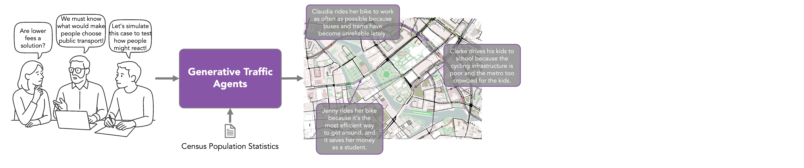

# GTA: Generative Traffic Agents for Simulating Realistic Mobility Behavior



This repository contains the code accompanying my master's thesis on integrating LLM-driven agents into traffic simulations. Our workflow proceeds in two steps:
1. **Schedule & mode generation**  
   Generative Traffic Agents (GTAs) use persona descriptions and prompts to produce daily activity schedules with transport modes.
2. **Traffic simulation**  
   The resulting `trips.xml` feeds into dynamic user-equilibrium tools and SUMO for traffic simulation.


## Preprocessing

In order for the simulation to execute, several files are necessary (street network, public transport specification,
etc.). These are not stored in github due to large file
size. [A .zip file can be downloaded here.](https://osf.io/rbtk7/?view_only=c8b78e8a322542d2bcaa41b7a051d735)

**Note:** It contains all files necessary to run but does not include the B1 data set from the MiD 2017 study. Therefore
it either
should be be requested from official sources or the "Mikrozensus
2023" file should be used. In order to do that, usages of
`SeedGeneratorMiD` can be swapped with `SeedGeneratorCensus`.

### Population data

Our approach uses the [B1 data set from the MiD 2017 study](https://mobilithek.info/offers/823147460382572544) that is
available upon request. However, other sources could be used. A simple, exemplary adaption exists for the "Mikrozensus
2023", the respective source is included in the .zip.
In order to use it, usages of `SeedGeneratorMiD` can be swapped with `SeedGeneratorCensus`.

### Network and public transport

We use openly available GTFS data to incorporate public transport and open street map as source for the network.
To generate a network use `scripts/netgen/setup_berlin_maps.sh` or `scripts/netgen/setup_wedding_maps.sh`. Due to
conversion errors inherent in `netconvert`, manual adaptation might be necessary in `netedit`.
To filter invalid public transportation trips use `scripts/duaiterate/duarouter_filter_pt.sh`.

### Geopackage files

To generate the gpk files used for fast access to buildings associated with specific osm attributes, see `scripts/gpk`.

## Execution

To deploy and execute on the cluster run:

```
chmod +x deploy_to_server.sh
./deploy_to_server.sh
```

To run it on your own machine, `run_sumo_sim.sh` can be used as reference. However, this is not recommended as local LLM
inference and a large simulation network have significant computational demands. If necessary, the local LLM inference
can be replaced with API requests by replacing `huggingface_chat_api.py`.

To exchange routing service from SUMO to OTP, start an otp instance, point in `src/osm_traffic_simulacra.py` to the
correct url and then run it.
To run an OTP instance on the Leipzig cluster do:

```
cd scripts/otp
sbatch run_otp.sh
```

Extract the url from the slurm logs and set it in `src/osm_traffic_simulacra.py` and execute
`./deploy_to_server.sh -o true`.

### Config

`src/config/config.py` contains exemplary config dictionaries that contain variables such as the network path.

### Traffic simulation

To run the actual traffic simulation, we can either use the `trips.xml` previously generated or run

```
cd scripts/population_scaling
python agents_replicator.py
```

to scale the number of agents by multiplying them with slightly different activity locations and starting times.
Then, invalid trips need to be filtered by running 
```
cd scripts/duaiterate
./duarouter_filter_trips.sh
```

Afterward a dynamic user equilibrium should be computed using
```
cd scripts/duaiterate
./duaiterate_filtered.sh
```

The simulation then can be run in sumo using a config similar to the one in `src/eval/wedding_simulation`.

## Evaluation

For evaluation scripts see `src/eval`.
